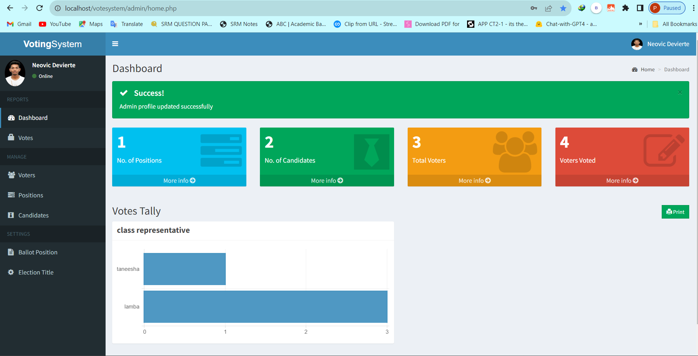
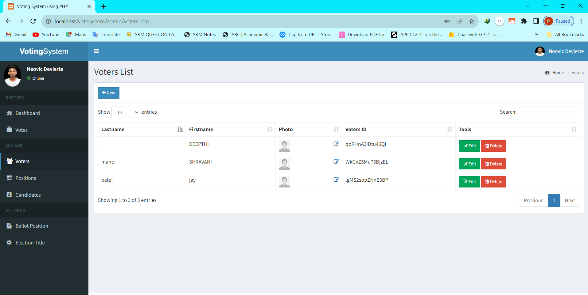
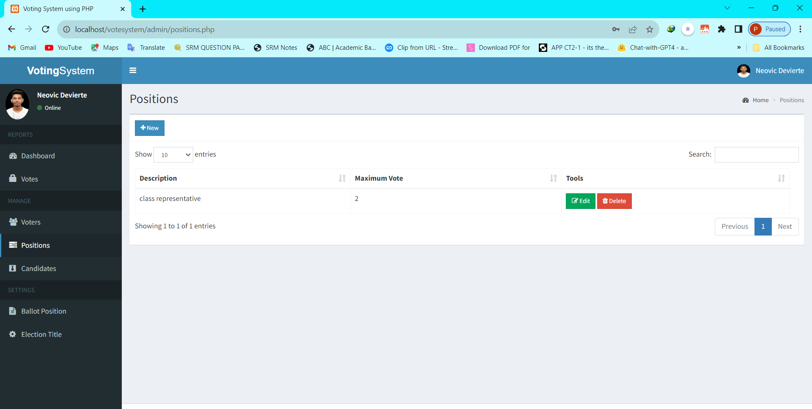
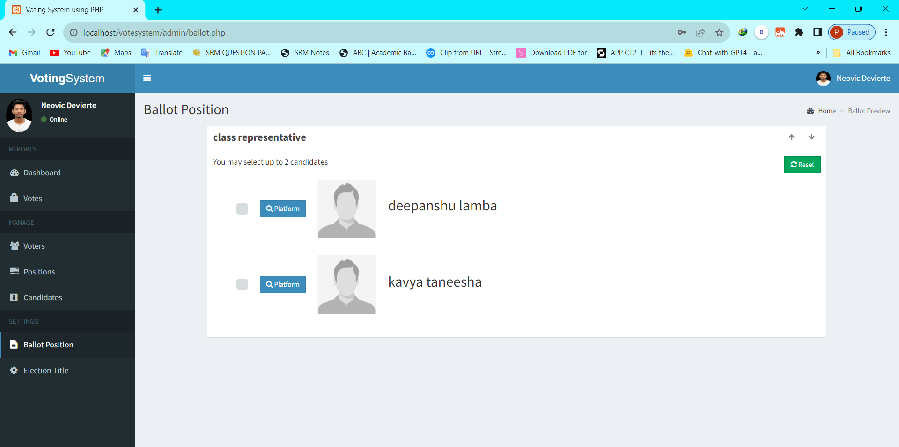
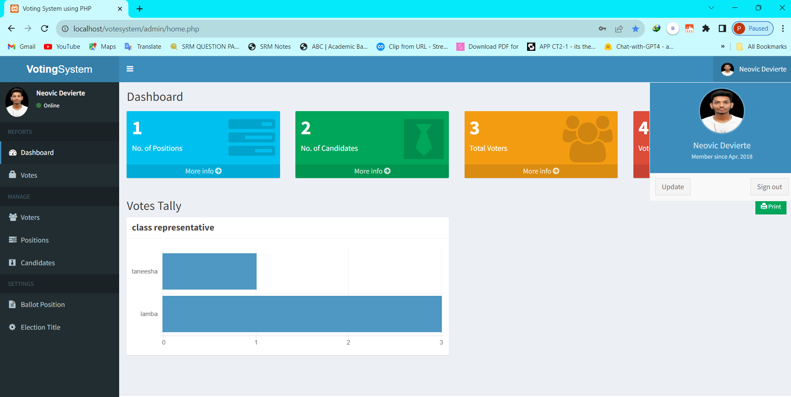

# Online Voting System

A simple and robust online voting system built using PHP. This project requires a SQL server and can be hosted on localhost using XAMPP.

 <!-- Add the direct link to your image in place of URL_TO_YOUR_IMAGE -->

## Prerequisites
- XAMPP
- SQL Server

## Installation & Setup

### Step 1: Get the Source Code
Clone or download the source code from [this GitHub repository](https://github.com/jaypatel7789/Online_Voting-System.git).  <!-- Add the link to your repository in place of URL_TO_YOUR_REPOSITORY -->

### Step 2: Install XAMPP
- Download XAMPP from [here](https://www.apachefriends.org/download.html).
- Install XAMPP on your machine.

### Step 3: Start XAMPP
- Launch the XAMPP control panel.
- Start both "Apache" and "MySQL".
- Click on 'Admin' for MySQL. A new page will open in your default browser. Keep this tab open.

### Step 4: Place Project in htdocs
- Navigate to the location where XAMPP is installed. Typically, it's `C:\xampp`.
- Open the `htdocs` folder.
- Paste the `onlinevoting` folder that you downloaded from the repository here. Ensure the path looks like `C:\xampp\htdocs\votesystem`.

### Step 5: Set Up Database
- In the browser tab opened from step 3, go to `localhost/phpmyadmin/server_sql.php`.
- Click on "New".
- Create a database named `votesystem` and click "Create".
- At the top, click on "Import".
- Browse and select the SQL file located at `C:\xampp\htdocs\votesystem\db` and click "Go".

### Step 6: Access the Voting System
- In a new browser tab, type `localhost/votesystem`. Your login page should appear as shown in the image above.

### Step 7: Log in
- Use the following credentials:
  - **Username:** Nurhodelta
  - **Password:** password

### Step 8: Home Page
After successfully logging in, you'll be directed to the home page.

### Step 9: Voters List
Enter a list of voters based on your candidates.

### Step 10: Add Positions Name
Specify the names of positions for voting.

### Step 11: Ballot Position
This is where you can view the ballot position.

### Step 12: Results
The final results are presented in a bar chart format for clarity.

Happy Voting!
